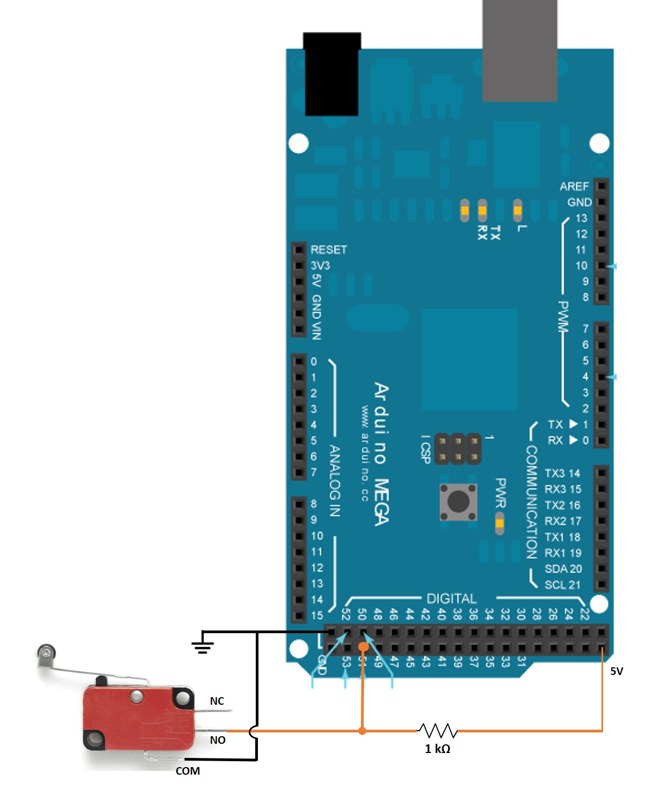

# EncoderLimit
Simple implementation of an encoder and limit switch to an Arduino. Basically, both are read using any microcontroller's 5V digital I/O pins.

Sample schematics with an Arduino MEGA 2560 are presented below:

## Encoder Schematic

## Limit Switch Scematic

